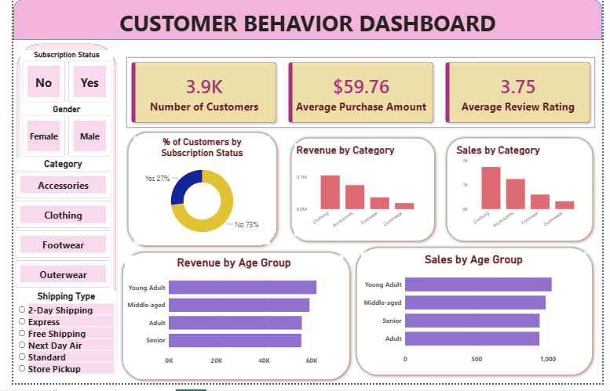

## Retail Customer Behavior Analysis

📌 Project Overview

This project presents an end-to-end retail customer behavior analysis using Python, PostgreSQL, and Power BI. The goal is to analyze customer purchasing patterns and create an interactive dashboard that provides meaningful business insights.

🛠️ Technologies Used

- Python
- Jupyter Notebook
- Pandas
- PostgreSQL
- Power BI

📂 Project Workflow

1. Collected the retail customer dataset.
2. Performed data cleaning and preprocessing using Python.
3. Stored and managed the data in PostgreSQL.
4. Connected PostgreSQL with Power BI.
5. Created an interactive dashboard to visualize customer behavior and sales trends.

📊 Dashboard Features

- Customer ID
- Age
- Age Group
- Gender
- Category
- Purchase Amount
- Review Rating
- Subscription Status
- Shipping Type
- Payment Method
- Frequency of Purchases

📸 Dashboard Preview

👩‍💻 Author

Monisha K
